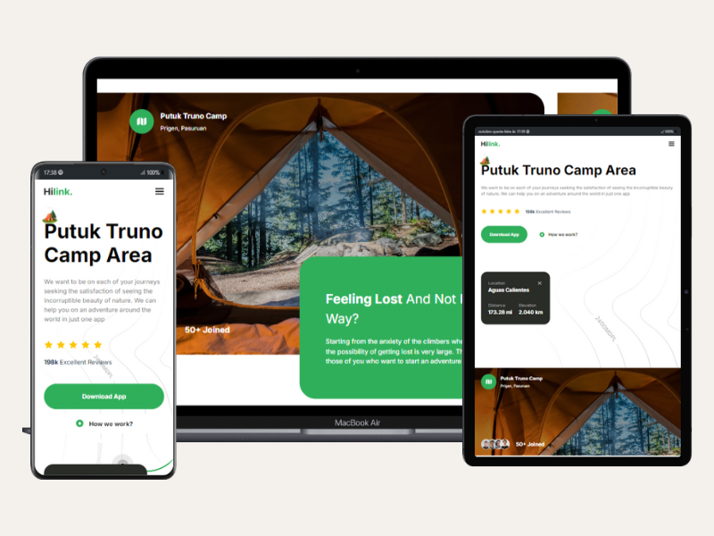
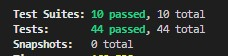

<div align="center"> 
  <h1>Travel Camp Landing Page</h1>
</div>

<div align="center"> 
  
  
   
  
  
  
  
  
  
</div>

## Description

The **Travel Camp Landing Page** is a sample application designed to provide an engaging visual experience for camping and nature enthusiasts. The primary objective of this project is to familiarize myself with **Next.js** while practicing the use of **Jest** and **Testing Library** for testing.

The page is fully **responsive**, ensuring an optimal user experience on devices of all sizes.

## Key Features

- **Responsive Design**: Adapts to different screen sizes.
- **Reusable Components**: Utilizes React components for greater efficiency and maintainability.
- **Automated Testing**: Implements tests using Jest and Testing Library to ensure code quality.
- **Modern Styling**: Utilizes **Tailwind CSS** for an attractive and easily customizable design.

## Screenshots

<div align="center">
  
</div>

<div align="center">
  
</div>

## Live Demo

You can view the live page on [Vercel](https://travel-camp-app-nextjs.vercel.app/).

## Connect with Me

You can find me on [LinkedIn](https://www.linkedin.com/in/evelinalvarado/).

## Clone the project

First, clone the repository to work with the code locally.

```bash
# Clone the repository
git clone https://github.com/EvelinAlvarado/travel-camp-app-nextjs.git

# Navigate to the project folder
cd travel-camp-app-nextjs
```
Feel free to explore the code and contribute to the project!
